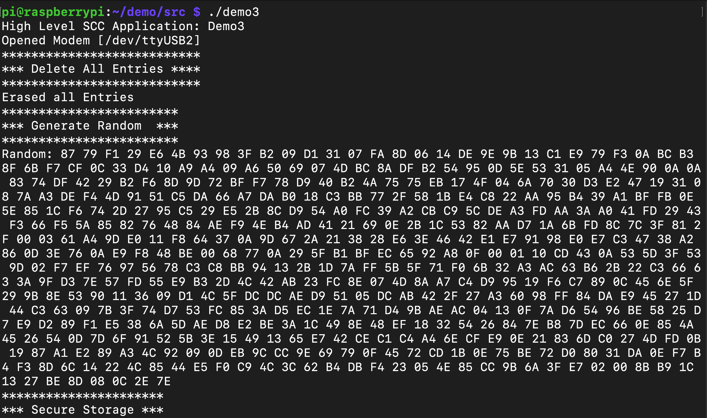

# Scc-DemoApplication
This is a guide on how to setup and run the demo3 application utilizing the GD library.

On the raspberry pi, cd to the following directory:
```
/home/pi/Downloads/demo/scc-lib/demo-src
```
Compile the demo3.cpp file

in the .../scc-lib/demo-src folder, issue the following command:

```
g++ demo3.cpp -lscc-toolkit -lssl -lcrypto -o demo3 -std=c++17

```
this generates the demo3 executable which can be run via the command: 

```
./demo3
```
The output should look like the following:




## Optional
If you require a clean version of the demo applcation it can be downloaded from workspaces (watchdocs). The scc-lib.zip contains the demo files.


Unzip and move the folder to the Raspberry pi

